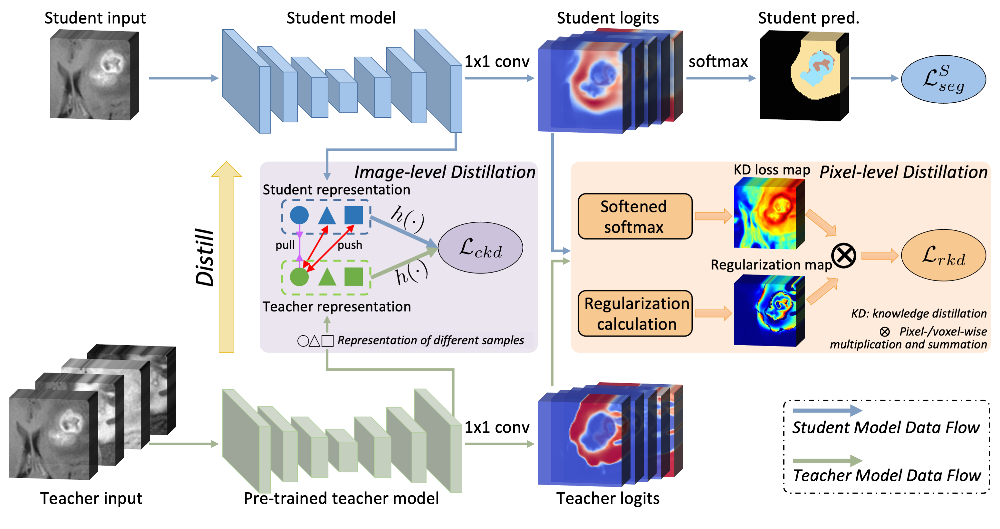

# Learning with Privileged Multimodal Knowledge for Unimodal Segmentation

Tensorflow implementation of our privileged multimodal knowledge learning framework. <br/>

## Paper
[Learning with Privileged Multimodal Knowledge for Unimodal Segmentation](https://ieeexplore.ieee.org/stamp/stamp.jsp?arnumber=9567675) TMI 2021
<p align="center">
  
</p>

## Installation
* Install TensorFlow 1.10 and CUDA 9.0
* Clone this repo
```
git clone https://github.com/cchen-cc/PMKL
cd PMKL
```

## Data Preparation
* Use `nii2tfrecord` function in `./preprocessing.py` to convert `nii` data into `tfrecord` format to be decoded by `./data_loader.py`

## Train
* Specify the data path in `./main.py`
* Run `./main.py` to start the training process

## Evaluate
* Specify the model path and data path in `./evaluate.py`
* Run `./evaluate.py` to start the evaluation.

## Citation
If you find the code useful for your research, please consider cite our paper.
```
@article{chen2021learning,
  title={Learning with Privileged Multimodal Knowledge for Unimodal Segmentation},
  author={Chen, Cheng and Dou, Qi and Jin, Yueming and Liu, Quande and Heng, Pheng Ann},
  journal={IEEE Transactions on Medical Imaging},
  year={2021},
  publisher={IEEE}
}
```
## Note
* Contact: Cheng Chen (chencheng236@gmail.com)
